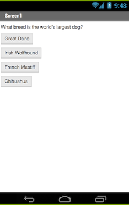

## Introduction

These cards are going to help you learn to build apps for Android phones and tablets by introducing you to App Inventor.

You're going to get the chance to:

 * Build a quiz that keeps score as the player goes through it
 * Use any questions and answers you like, maybe about your favourite band or sport, or a book, movie, or TV show you love.
 
I'm going to do my quiz on dogs, because I like dogs a lot. If you want to follow along with me, you're welcome to. If dogs are not your thing, then wherever I have a dog–themed question, you can come up with your own question, the right answer, and some answers that sound like they might be right! If you're going to make your own quiz, have a think about that now and maybe brainstorm some ideas with the other Ninjas in your Dojo about what kind of questions you should have.

### What you will make

You'll end up with something that looks like this, and you can play around with colours and adding images to brighten it up if you like:
 

--- collapse ---
--- 
title: What you will learn
---

+ How to use App Inventor to make Android apps
+ Adding components to the screen and changing their properties
+ Adding screens and writing code to move between them
+ Using buttons to trigger an action
+ Storing information between screens

--- /collapse ---

--- collapse ---
--- 
title: What you will need
---

### Hardware

+ A computer capable of accessing App Inventor
+ An internet connection

**Optional:**

+ An Android phone or tablet

--- /collapse ---

Once you've learned these techniques, you can apply them to create more than just a quiz! These same coding tools can be used to make a complete interactive story, or to build a calculator or a whole bunch of other cool apps.