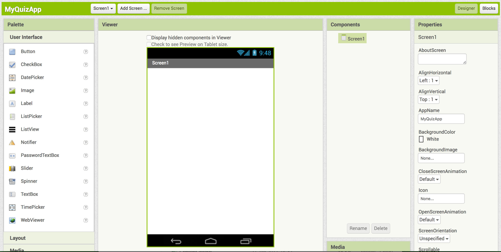

## Getting set up

Before you can start coding your quiz app, you're going to need an account on the App Inventor website. 

+ Go to [dojo.soy/appinv-start](http://dojo.soy/appinv-start){:target="_blank"} and then click on the **Create apps!** button in the top right-hand corner of the screen.

The website will ask you to sign in with a Google account. If you don't have one, you'll need to create one or use your parent's/guardian's account.

Once you have signed in with a Google account, App Inventor will show you options to either set up an Android device (a phone or tablet) or install an emulator (a program that acts like an Android device) on your computer.

--- collapse ---
---
title: Which option should I choose?
---

**You may need a mentor at your Dojo to help you with this step!** 

If you do not have a device available (your own or one from your Dojo), and the emulator isn't on your computer already, then you need to install it.

Otherwise, you can set up your own device or a Dojo device, or if the Dojo already has devices set up, move on to coding. 

If you need to do either kind of setup, click on the right link on the App Inventor website and follow the instructions there. Once you've finished setting up, come back to these Sushi Cards.

--- /collapse ---

Right! Now you're all set to go, it's time to create your first Android app.

+ Go back to App Inventor in your browser and click on the **Start new project** button in the top left-hand corner of the screen.

+ Call your project `MyQuizApp` and click **OK**.

You'll see a screen like this one, which means you're ready to get coding!

You can see that the App Inventor **Designer** view is broken into four key sections:
 + **Palette**, from which you pick the components you will use to build your app
 + **Viewer**, where you can see the app you are working on, and rearrange and select components
 + **Components**, where you can see a list of the components in your app, and their relationships to each other
 + **Properties**, where you can see and change the properties of the component you have selected at the moment
  
There are other buttons and even another view, but these four sections are what you'll be using right now.
