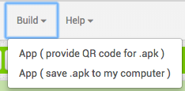

## Wrapping up

Now that you're finished adding questions and connecting screens, you need a way to tell the player how they did!

+ Create one more screen called **ScoreScreen** with nothing but a Label on it. You also need to drag the TinyDB on so you can access the score.

+ Now switch to the Blocks view and use blocks from the **ScoreScreen**, **Label1**, **Text**, **TinyDB1**, and **Math** sections to put this together:

+ You should now be able to go to the **Connect** menu and choose the emulator or other connected device that you set up for testing your apps (you might need a mentor's help here!) and see how your code works right now.

   

--- collapse ---
---
title: How can I install my app on a phone or tablet?
---

+ To build a working app that you can install on your Android device, use one of the options from the **Build** menu: you can either download the app installer directly, or get a QR code that you can scan to download the app to your device.

  

--- /collapse ---

That's it! You've got a quiz that will keep score across all its pages, no matter how many you add, and will tell the player how they did at the end. Nice work! Check out the next card for a few ideas on what else you can do with what you know now!
